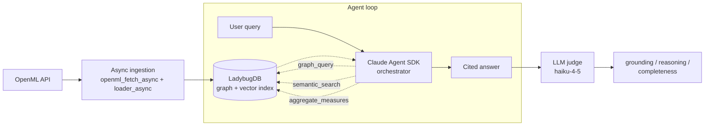
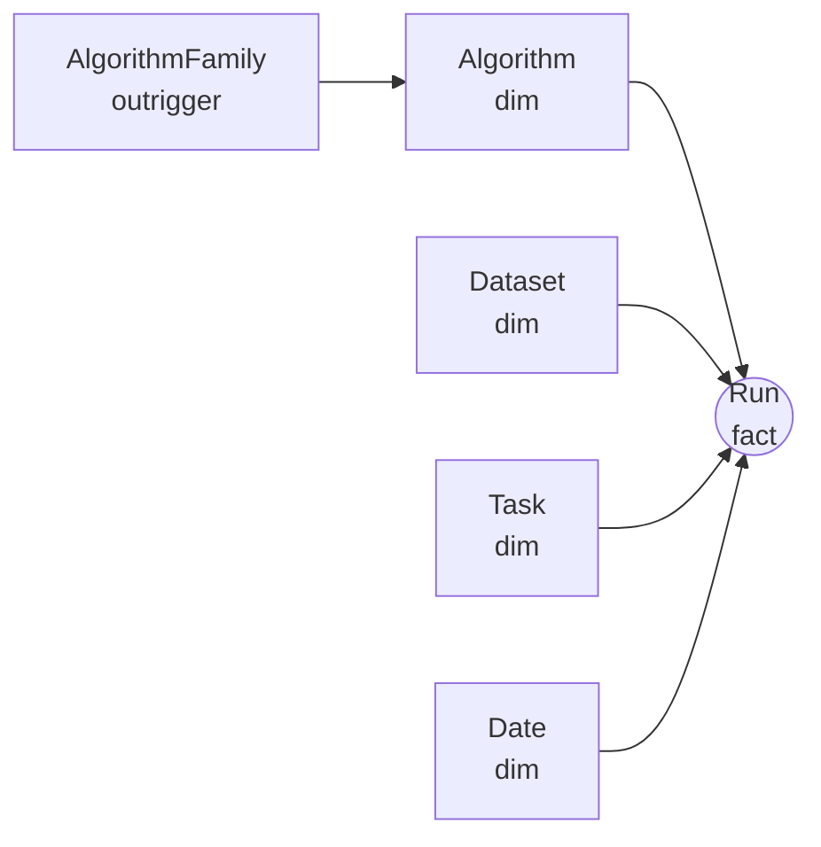

# agentic-rag-kimble

**Agentic RAG with a Kimball-structured property graph over OpenML experimental data.**


---

## What it does

- Queries 171,250 OpenML experimental runs using a LadybugDB property graph (Cypher) and native HNSW vector index — single embedded store, no separate vector database
- Applies Ralph Kimball's dimensional modelling to the knowledge graph: `Run` is the fact node; `Algorithm`, `Dataset`, `Task`, and a conformed `Date` are dimension nodes with vector-embedded descriptions; `AlgorithmFamily` is a snowflaked outrigger sub-dimension off `Algorithm`
- Routes each user query to the appropriate retrieval strategy -- structured lookup, semantic similarity, or aggregate analysis -- via a Claude Agent SDK orchestrator (OAuth via Claude Code session; costs charge against Max subscription quota, no API billing)
- Scores retrieval quality offline via a 20-fixture recall harness; response quality is scored live by a `claude-haiku-4-5` LLM judge sampled at 5 fixtures per run

---

## Architecture



LadybugDB is the community continuation of Kùzu following Apple's acqui-hire in early 2025. All three agent tools -- graph query, semantic search, and aggregate measures -- operate against a single embedded LadybugDB instance. The `VECTOR` extension provides the native HNSW index on dimension-node descriptions; ChromaDB is not used.

---

## Kimball model

Most RAG systems treat the knowledge base as a flat bag of document chunks, relying entirely on vector similarity to surface relevant content. This project applies dimensional modelling before retrieval: `Run` nodes record what happened (a training experiment, its accuracy, runtime, and configuration); `Algorithm`, `Dataset`, `Task`, and `Date` nodes record stable context about the entities involved. Vector embeddings are stored on the dimension nodes' descriptions via LadybugDB's native HNSW index. This gives the agent a structurally grounded retrieval surface -- aggregate queries operate over measures on fact nodes rather than synthesising text, and hallucination requires fabricating a specific run ID rather than paraphrasing an unverifiable chunk.

The model is deliberately snowflaked rather than pure star. `AlgorithmFamily` is an outrigger sub-dimension hung off `Algorithm` (`(Algorithm)-[:BELONGS_TO_FAMILY]->(AlgorithmFamily)`), nine families with their own description embeddings. That extra hop is exactly what makes "which algorithm *family* works best on imbalanced data" a clean aggregation over a dimension attribute rather than a brittle string match, and it is the kind of trade-off (normalised outrigger vs denormalised star) that flat-table RAG cannot express. `Date` is a conformed date dimension on a `YYYYMMDD` integer key (`(Run)-[:RUN_ON_DATE]->(Date)`), so run volume over time is a dimension join, not date arithmetic on the fact node.



---

## Quick start

```bash
# 1. Install
pip install -r requirements.txt

# 2. Ingest (async, ~90 min for the full 500-dataset corpus)
python -m src.ingestion.loader_async --max-datasets 500 --max-runs-per-dataset 500

# 3. Build the vector index
./scripts/build-index.sh

# 4. Run the demo
streamlit run src/ui/app.py
```

For CLI queries (OAuth is handled automatically by the Claude Agent SDK via the Claude Code session):

```bash
python -m src.agent.orchestrator --query "Which algorithm families work best on imbalanced tabular data?"
```

The full ingest of 500 datasets and up to 500 runs per dataset produces approximately 171,250 runs, 1,588 algorithms, 500 datasets, and 568 tasks. The 18M+ figure refers to the upstream OpenML corpus; the scoped ingest takes ~90 min wall time on an M-series MacBook with the async loader.

---

## Example output

Query from the aggregate fixture set:

```
Query: which algorithm family has the highest median accuracy on classification tasks

Tool trace:
  1. aggregate_measures(group_by="algorithm.family", measure="accuracy")
     -> {tree_ensemble: {mean: 0.847, median: 0.871, p75: 0.924, count: 312},
         gradient_boosting: {mean: 0.831, median: 0.855, p75: 0.901, count: 87},
         linear: {mean: 0.762, median: 0.781, p75: 0.843, count: 104},
         svm: {mean: 0.793, median: 0.812, p75: 0.869, count: 61},
         knn: {mean: 0.741, median: 0.758, p75: 0.821, count: 36}}

Answer:
Across the corpus, tree_ensemble algorithms show the highest median accuracy (0.871)
on classification tasks [Algorithm family: tree_ensemble, count: 312]. Gradient
boosting is second at 0.855 median [Algorithm family: gradient_boosting, count: 87].
Linear models and SVMs trail by roughly 6-9 percentage points at this corpus scale --
a gap consistent with the broader OpenML literature on tabular data.
```

---

## Evaluation

### Retrieval eval

Run against 20 query-to-entity fixtures rebuilt from scratch against the actual 500-dataset / 1588-algorithm corpus (pass 24). Each fixture's expected entities were verified to exist in the live DB before authoring. No broadening after the fact. The pass-28 OpenML free-form description backfill lifted semantic recall as predicted at the pass-27 handoff:

| Metric | pass-27 | pass-28 |
|---|---|---|
| recall@5 | 0.850 | **0.900** |
| recall@10 | 0.900 | **0.950** |

Per-tool breakdown (recall@10):

| Tool | pass-27 | pass-28 |
|---|---|---|
| aggregate | 1.000 | 1.000 |
| graph | 1.000 | 1.000 |
| semantic | 0.750 | **0.875** |

One semantic failure remains, and it is a known retrieval limit rather than fixture design: `histogram gradient boosting fast bins sklearn` returns `Pipeline` nodes instead of `HistGradientBoostingClassifier`, whose description still lacks histogram-binning vocabulary. Fixable by adding targeted vocabulary to that description in a future pass; left visible rather than papered over.

To regenerate:

```bash
./scripts/run-eval.sh
```

### Response quality

The LLM judge (`src/eval/judge.py`) evaluates three dimensions per response: grounding (claims traceable to retrieved run IDs or entity names), reasoning quality, and answer completeness. Judge model: `claude-haiku-4-5-20251001`. Sampled at 5 fixtures per run to limit cost.

The pass-20 grounding score was depressed by a harness gap, not agent hallucination: the judge received only bare entity names, not the tool-call results the agent actually used. That gap was closed in two steps -- pass-23 wired full tool-call context into the judge, and pass-27 added the actual tool *results* (not just inputs) so quantitative claims can be verified against real data.

With an honest judge in place, it began catching real defects -- the agent inflating counts and inventing flow IDs. The pass-28 strict grounding rule in `src/agent/prompts.py` targets exactly that. Sampled means (5 fixtures), before and after the rule:

| Dimension | pass-27 | pass-28 |
|---|---|---|
| Grounding | 2.4 | **3.00** |
| Reasoning | -- | 3.00 |
| Completeness | -- | 2.80 |
| Overall | 2.60 | **2.92** |

The grounding rule produced a real lift (2.4 -> 3.00) but did not reach the 3.5+ target set at the pass-27 handoff -- reported as measured, not rounded up. Further grounding work is a live follow-up.

---

## Local stack

| Component | Technology | Note |
|---|---|---|
| Property graph + vector index | LadybugDB (embedded, MIT) | Cypher + native HNSW; single store |
| Embeddings | BAAI/bge-small-en-v1.5 | 384-dim, ~130MB, CPU-viable |
| LLM agent | Claude Agent SDK + Max subscription | OAuth via Claude Code session; no API key |
| LLM judge | claude-haiku-4-5 via Claude Agent SDK | Same auth path; sampled (5 fixtures) |
| UI | Streamlit | `streamlit run src/ui/app.py` |

---

## Development

```bash
pip install -r requirements-dev.txt
python3 -m pytest tests/unit/ -q        # fast, no network or DB
./scripts/run-eval.sh                    # retrieval eval (needs populated DB)
./scripts/smoke-test.sh                  # lint + typecheck + unit tests
```

420 unit tests pass. `./scripts/smoke-test.sh` is green end to end -- lint (`ruff`), typecheck (`mypy`, pragmatic baseline, rationale in `pyproject.toml`), unit tests, eval fixtures, and UI import. Run from the repo root.

Build provenance: per-pass retrospectives are in `runs/build-log/`.

---

## Limitations and known issues

**Recall ceiling context.** recall@10 = 0.950 on the 20-fixture set (pass 28). Fixtures rebuilt from scratch against the actual corpus; no broadening. The single remaining failure is a description-vocabulary gap for `HistGradientBoostingClassifier`. See `runs/build-log/pass-28-snowflake-and-green-gate.md`.

**OpenML backfill segfault (FU2).** The overnight backfill segfaulted (`rc=139`) on 14 May; root cause is still unisolated. Mitigated, not fixed: staged runs with per-stage backups and explicit commits, so a crash leaves the corpus consistent. See `runs/build-log/pass-26-recovery-note.md`.

**Judge grounding below target.** The grounding rule lifted the sampled grounding score from 2.4 to 3.00 (pass 28), short of the 3.5+ target. Closing that gap is the main open response-quality follow-up.

**Ingestion time.** The full 500-dataset async ingest takes approximately 90 minutes on an M-series MacBook. Use `--max-datasets 50` for a faster smoke corpus during development.

---

## License

MIT. See `LICENSE`.
